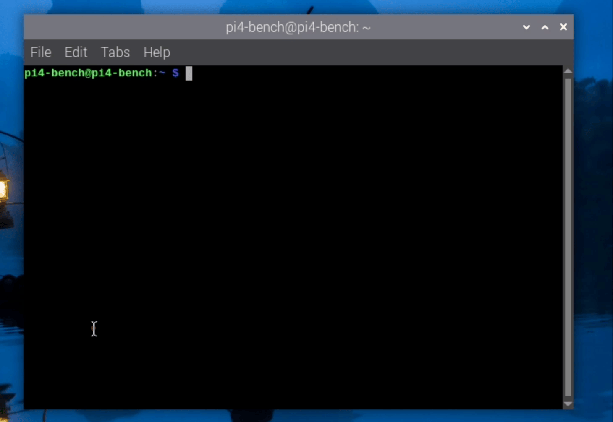
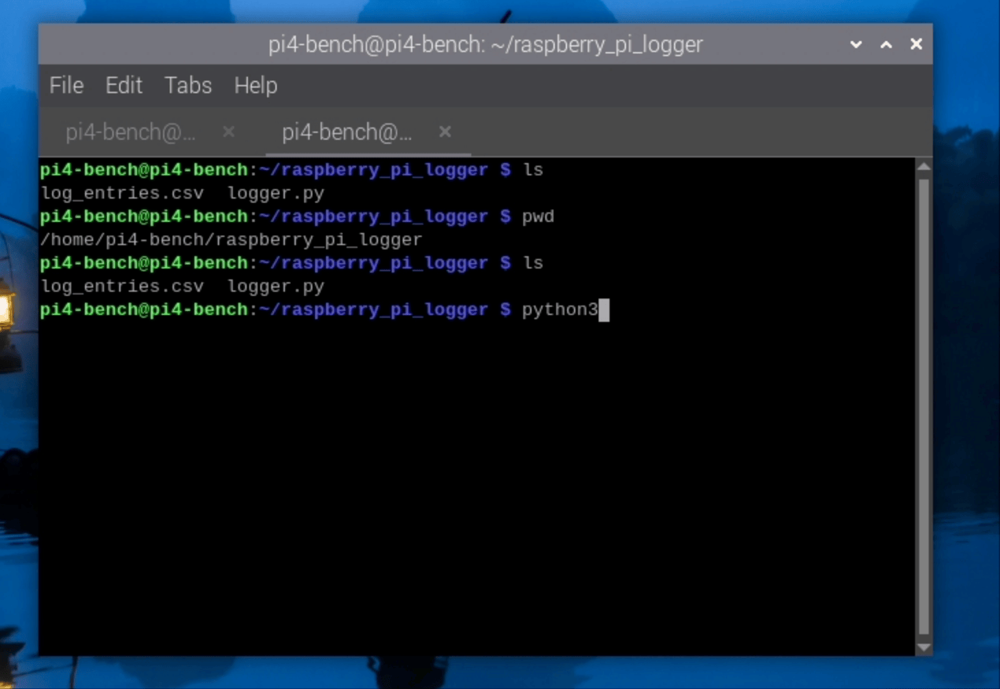

# Pi-Logger

This project provides a simple script for logging various system diagnostics on a Raspberry Pi. The script collects data such as CPU usage, memory usage, disk space, network statistics, and system temperature, and appends this information to a CSV file named `log_entries.csv`. If the CSV file does not exist, it will be created automatically with the appropriate header row.

- [Pi-Logger](#pi-logger)
  - [Overview](#overview)
  - [Prerequisites](#prerequisites)
    - [Hardware](#hardware)
    - [Software](#software)
  - [Setup and Installation](#setup-and-installation)
    - [Installation](#installation)
    - [Usage](#usage)
    - [Logger Script](#logger-script)
  - [Explanation](#explanation)
  - [Running the Script](#running-the-script)
    - [Manual Execution](#manual-execution)
    - [Automating the Logging Process](#automating-the-logging-process)
  - [Conclusion](#conclusion)
    - [Summary](#summary)
    - [Additional Resources](#additional-resources)
    - [Supplementary Materials](#supplementary-materials)


## Overview

The Raspberry Pi diagnostics logger script is designed to monitor and log key system metrics for a Raspberry Pi. By running this script at regular intervals, you can track the performance and health of your Raspberry Pi over time. 

The script collects the following system diagnostics:

- **CPU usage as a percentage**
- **Memory usage in megabytes**
- **Disk usage as a percentage**
- **Network statistics (*bytes sent and received*)**
- **System temperature (*Tested only with rpi*)**

The script logs these metrics to a CSV file named `log_entries.csv`, which can be analyzed to identify trends, troubleshoot performance issues, or monitor system health. 

## Prerequisites

### Hardware
Before using the Raspberry Pi diagnostics logger, make sure you have the following:

1. Raspberry Pi running Raspberry Pi OS (or any compatible Linux distribution with Systemctl/Systemd services and/or CRON setup enabled)

>  Notes:
> 1.  This script is designed to run on a Raspberry Pi with the default configuration. It may require modifications to work on other systems or distributions. 
> 2. For the latest version of Raspberry Pi OS, visit the [Raspberry Pi OS download page](https://www.raspberrypi.org/software/operating-systems/). Follow the [Raspberry Pi OS installation guide](https://www.raspberrypi.org/documentation/installation/installing-images/README.md) for detailed instructions on how to install it on your Raspberry Pi.
> 


### Software

2. Basic knowledge of the following concepts:
   - Python programming language
   - Basic Linux commands and file management
   - Using the terminal on Raspberry Pi
   - Using CRON jobs (for automated logging)
   - Using Systemctl/Systemd services (for automated logging)
   - Using Bash scripts (for automation)
   - Using CSV files for data storage
   - Using text editors like Nano or Vim


If you are new to Raspberry Pi or any of the above concepts, don't worry! You can learn as you go by following the instructions provided in this guide. I'll provide some additional resources and references to help you understand the concepts better.

## Setup and Installation

### Installation



1. **Update your system**: Before starting, ensure your Raspberry Pi is up to date.
   ```bash
   sudo apt update
   sudo apt upgrade
   ```

2. **Install required packages**: You may need to install the `psutil` library for system monitoring.
   ```bash
   sudo apt install python3-pip
   pip3 install psutil
   ```

3. **Download the script**: Create a directory for your project and download the script.
   ```bash
   mkdir ~/raspberry_pi_logger
   cd ~/raspberry_pi_logger
   nano logger.py
   ```

4. **Copy the script**: Paste the provided Python script into the `logger.py` file and save it.

### Usage

To run the logger, simply execute the script (filled with the provided [code below](#logger-script)) using Python. The script will automatically log the diagnostics to `log_entries.csv`.

```bash
python3 logger.py
```

### Logger Script 

Here is the complete script for the Raspberry Pi diagnostics logger in Python (save it as `logger.py`):

```python
import os
import csv
import psutil
from datetime import datetime

# Define the CSV file name
csv_file = 'log_entries.csv'

# Check if the CSV file exists, if not, create it and write the header
if not os.path.exists(csv_file):
    with open(csv_file, mode='w', newline='') as file:
        writer = csv.writer(file)
        writer.writerow(['Timestamp', 'CPU Usage (%)', 'Memory Usage (MB)', 'Disk Usage (%)', 'Network Sent (bytes)', 'Network Received (bytes)', 'Temperature (°C)'])

# Function to get system diagnostics
def get_system_diagnostics():
    # Get current timestamp
    timestamp = datetime.now().strftime('%Y-%m-%d %H:%M:%S')

    # Get CPU usage
    cpu_usage = psutil.cpu_percent(interval=1)

    # Get memory usage
    memory_info = psutil.virtual_memory()
    memory_usage = memory_info.used / (1024 * 1024)  # Convert bytes to MB

    # Get disk usage
    disk_info = psutil.disk_usage('/')
    disk_usage = disk_info.percent

    # Get network statistics
    net_info = psutil.net_io_counters()
    network_sent = net_info.bytes_sent
    network_received = net_info.bytes_recv

    # Get temperature (for Raspberry Pi)
    try:
        with open('/sys/class/thermal/thermal_zone0/temp') as temp_file:
            temperature = float(temp_file.read()) / 1000  # Convert from millidegrees to degrees Celsius
    except FileNotFoundError:
        temperature = None

    return [timestamp, cpu_usage, memory_usage, disk_usage, network_sent, network_received, temperature]

# Main function to log the data
def log_data():
    diagnostics = get_system_diagnostics()
    with open(csv_file, mode='a', newline='') as file:
        writer = csv.writer(file)
        writer.writerow(diagnostics)

if __name__ == '__main__':
    log_data()
```

The script will log the system diagnostics to a CSV file named `log_entries.csv` in the same directory where the script is located. You can modify the script to include additional diagnostics or customize the output as needed.




## Explanation

1.  The script first imports the necessary modules: `os`, `csv`, `psutil`, and `datetime`.
2.  Then, it defines the `csv_file` variable to store the name of the CSV file where the log entries will be stored.
3.  The script checks if the CSV file exists. If it does not, it creates the file and writes the header row with the column names.
4.  The `get_system_diagnostics` function collects various system metrics using the `psutil` library:
    - CPU usage as a percentage
    - Memory usage in megabytes
    - Disk usage as a percentage
    - Network statistics (bytes sent and received)
    - System temperature (for Raspberry Pi)
    - The function returns these metrics as a list.
5.  The `log_data` function calls `get_system_diagnostics` to get the system metrics and appends them to the CSV file.
6.  The `__main__` block calls the `log_data` function when the script is run.

## Running the Script

### Manual Execution
- To run the script manually, use the command:
  ```bash
  python3 logger.py
  ```

The script will log the system diagnostics to the `log_entries.csv` file in the same directory where the script is located.
  
- You can view the log entries by opening the CSV file in a text editor or spreadsheet application.
- To stop the script, press `Ctrl+C` in the terminal.
- You can run the script manually whenever you want to log the system diagnostics once.

### Automating the Logging Process

For automated logging, you can set up a CRON job or a Systemctl service to run the script at regular intervals. See the following sections for instructions on setting up automation:

- [Setting up a CRON Job](./autorun/cron/README.md)
- [Setting up a Systemctl Service](./autorun/systemctl/README.md)

For those who are new or want to compare different methods of automation using CRON jobs or Systemctl services, I have provided a [comparison of the two methods](./autorun/Cron-Vs-Systemd-Comparison.md) so you can choose the one that best suits your needs.


## Conclusion

### Summary

The Raspberry Pi diagnostics logger provides a simple way to monitor system performance and collect data for analysis. By logging key metrics such as CPU usage, memory usage, disk space, network statistics, and system temperature, you can gain insights into the health and performance of your Raspberry Pi over time.

Feel free to modify the script to include additional diagnostics as needed!

### Additional Resources 
- [Raspberry Pi](https://www.raspberrypi.org/)
  - [Raspberry Pi OS](https://www.raspberrypi.org/software/operating-systems/)
  - [Raspberry Pi OS Download](https://www.raspberrypi.org/software/operating-systems/)
  - [Raspberry Pi OS Installation Guide](https://www.raspberrypi.org/documentation/installation/installing-images/README.md)

### Supplementary Materials
- [Working with Python](https://www.python.org/)
  - [Python Documentation](https://docs.python.org/3/)
  - [Python Basics](https://www.learnpython.org/)
  - [Python Tutorials](https://realpython.com/tutorials/basics/)
  
- [Working with Linux](https://www.linux.org/)
  - [Linux Commands](https://www.linux.org/commands/)
  - [Bash Scripting](https://www.gnu.org/software/bash/)
  - [Cron vs Systemctl](https://www.redhat.com/sysadmin/cron-vs-systemd-timers)

- [Tutorials](https://www.tutorialspoint.com/index.htm)
  - [Python Tutorial](https://www.tutorialspoint.com/python/index.htm)
  - [Linux Tutorial](https://www.tutorialspoint.com/unix/index.htm)
  - [Bash Scripting Tutorial](https://linuxconfig.org/bash-scripting-tutorial-for-beginners)
  - [CRON Tutorial](https://www.ostechnix.com/a-beginners-guide-to-cron-jobs/)
  - [Systemctl Tutorial](https://www.digitalocean.com/community/tutorials/systemd-essentials-working-with-services-units-and-the-journal)

